

  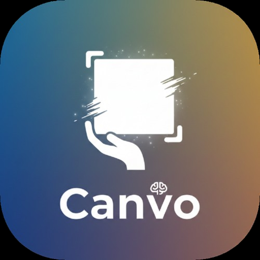

<h1 align="center">Canvo</h1>

  <strong>AI Agent · Data Canvas · Linux Sandbox — on your phone.</strong>

  
  
  
  

  <a href="https://canvo.cloud">Website</a> · <a href="https://github.com/canvos-app/canvos/releases/latest">Download APK</a> · <a href="PRIVACY.md">Privacy</a> · <a href="mailto:dev@canvo.cloud">Contact</a>

---

  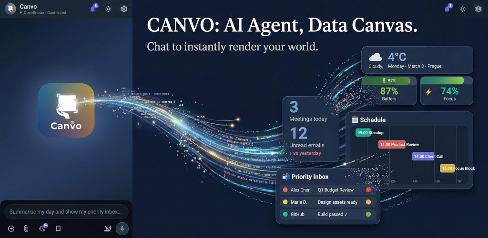

## What is Canvo?

Canvo turns your phone into a **full AI workstation**. It's not a chatbot — it's an AI agent with a live interactive canvas, a real Linux environment, and tools that multiply.

Chat naturally, and the agent renders your world: **dashboards, charts, quizzes, emails, schedules, budget trackers** — right in the conversation. Every response is a living, interactive workspace.

## ✨ Three Superpowers

### 🎨 The Canvas
> Your agent renders. You interact.

- Cards, charts, tables, forms, toggles, progress bars
- Animated D3 visualizations with real-time controls
- Quizzes, interactive maps, mini-games
- Every response is a living workspace

### 🖥️ Linux Sandbox
> A real shell on your phone.

- 300+ Unix commands — grep, awk, curl, wget…
- Install Python, Node.js, Git, FFmpeg, and more
- Build full web apps that run locally
- Persistent workspace across sessions

### 🔧 Unlimited Tools
> If a tool doesn't exist, the agent builds it.

- Web search, calendar, contacts, clipboard
- File I/O, notifications, TTS, timers
- Self-building tool scripts — saved and reused
- **Heartbeat**: scheduled autonomous tasks

## 📱 Screenshots

  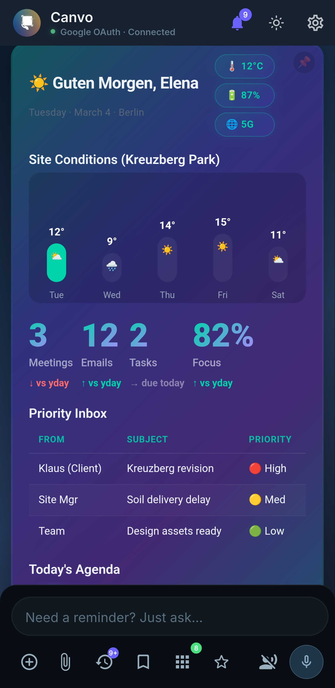
  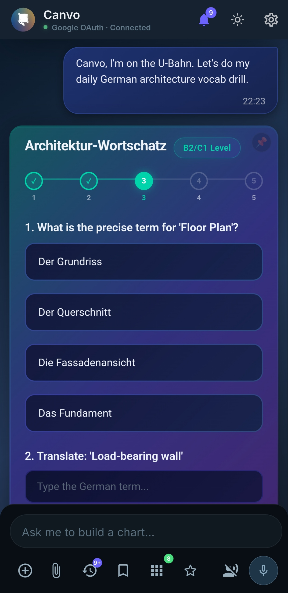
  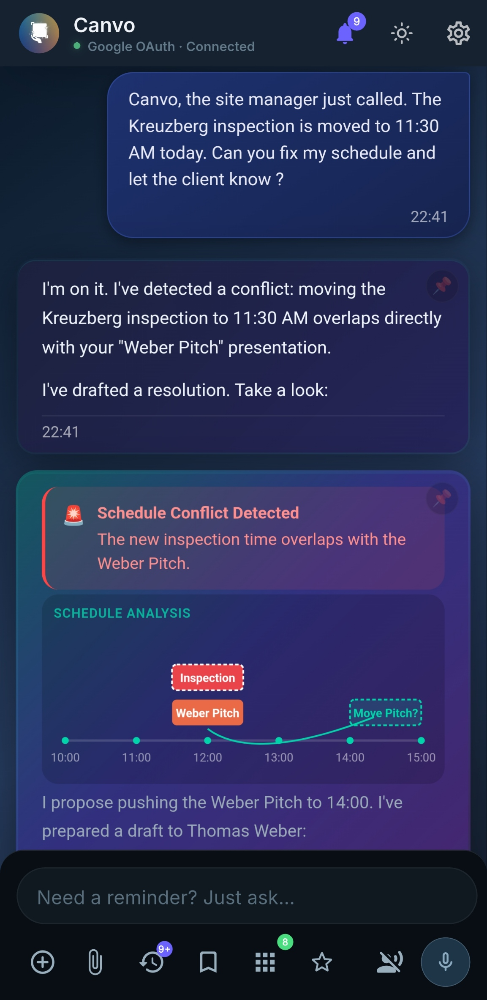
  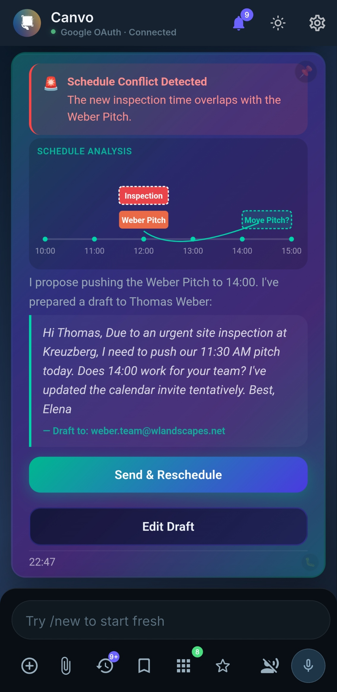

  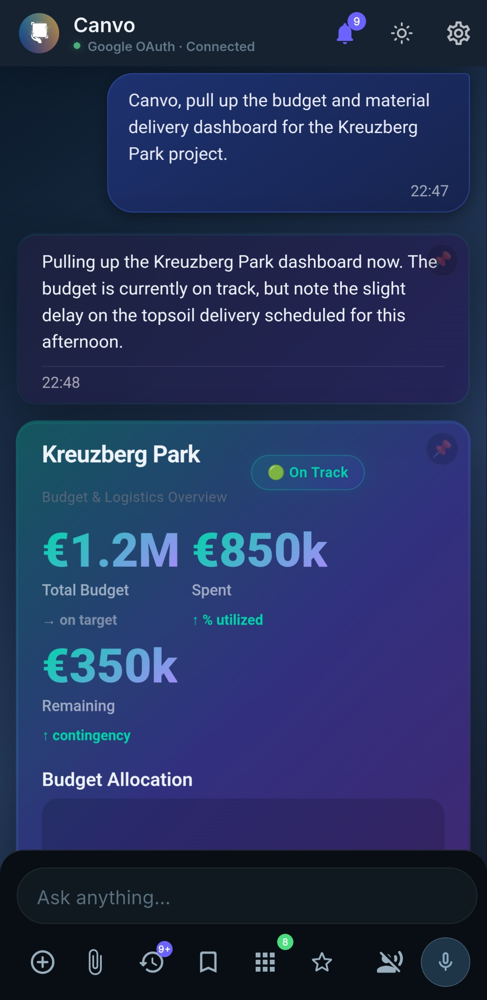
  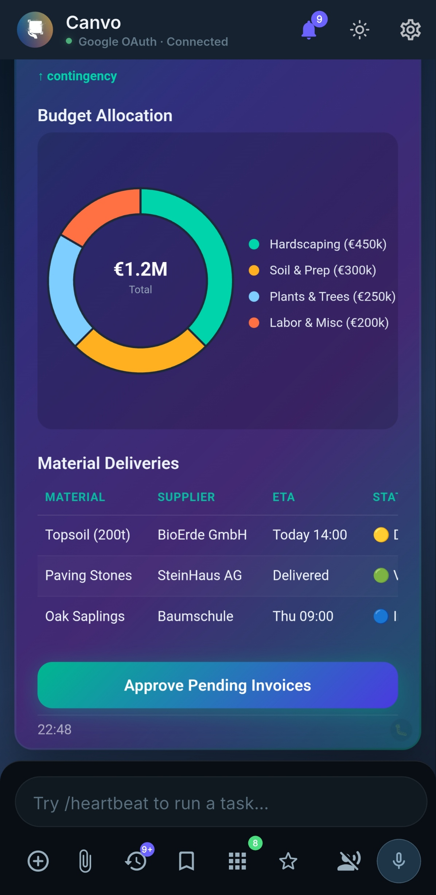
  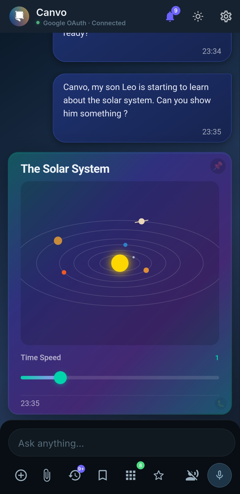
  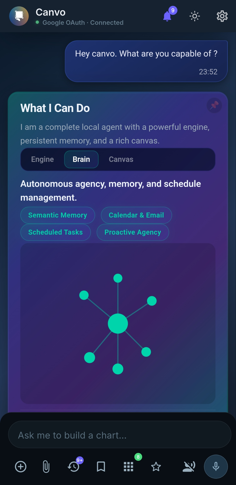

  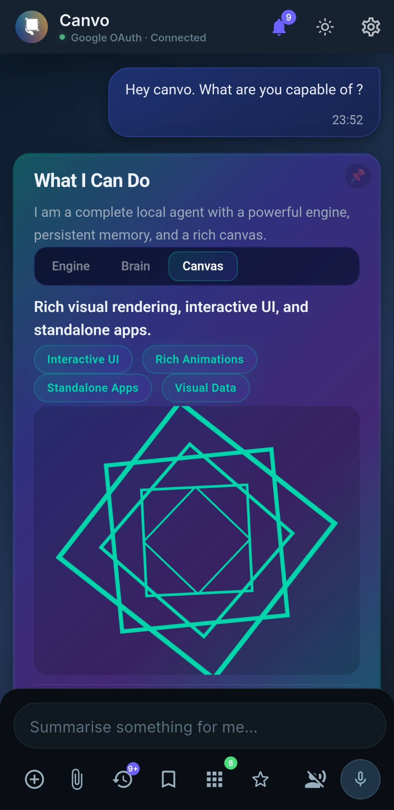
  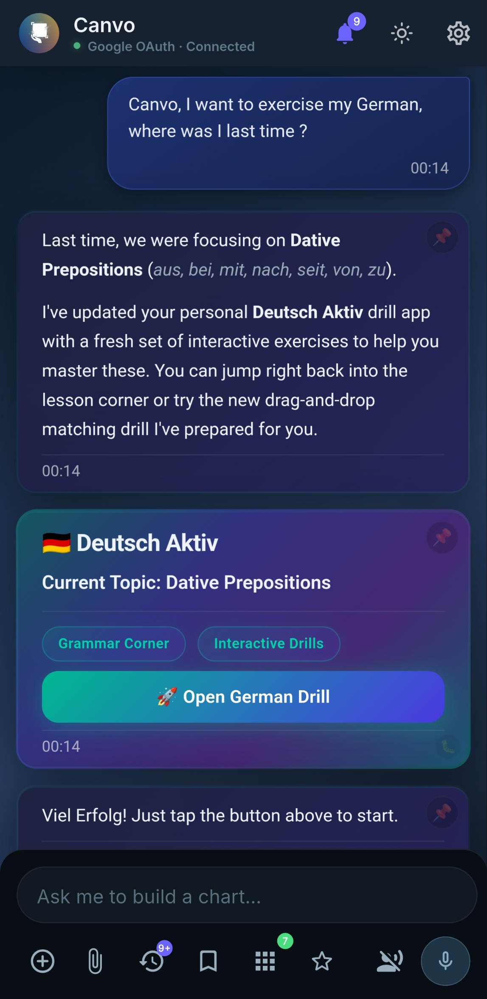
  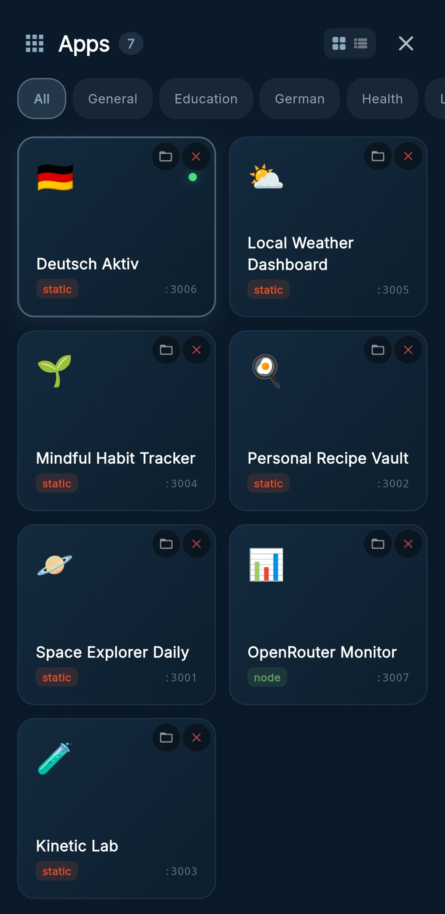
  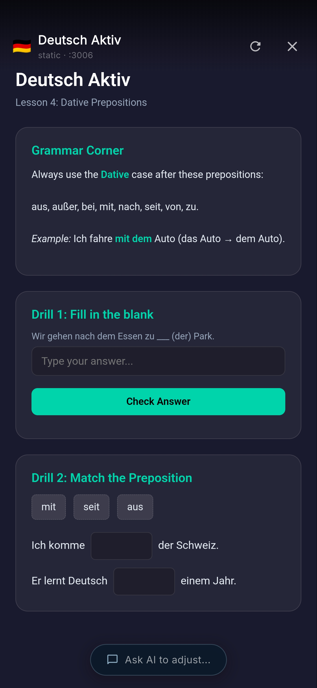

## 🔐 Privacy First

- **Bring Your Own Keys** — OpenAI, Anthropic, Gemini, Groq, Mistral, OpenRouter, Ollama, LM Studio, or any OpenAI-compatible endpoint
- **Local-First** — All conversations, files, and agent memory stay on your device
- **No account required** — No cloud sync, no telemetry
- **Google OAuth** — Optional sign-in for Gemini access (no API key needed)

## 📥 Install

1. Download the latest APK from [**Releases**](https://github.com/canvos-app/canvos/releases/latest)
2. On your Android device, enable **Settings → Install unknown apps** for your browser
3. Open the downloaded APK and tap **Install**
4. Launch Canvo and configure your AI provider in Settings

> **Requirements:** Android 13+ · arm64-v8a

## 🔄 Always Working

Canvo isn't just reactive. Schedule autonomous agent tasks that fire throughout the day:

- ⏰ **Heartbeat** — Autonomous scheduled tasks
- 🧠 **Memory** — Persistent knowledge base that grows
- 🔔 **Proactive** — Morning briefings, reminders, standups

Your agent wakes up, reads your notes, searches the web, and sends notifications — without you touching the screen.

## 🛠️ Multi-Provider

Switch between AI providers per session. Use the best model for the task:

| Provider | Models |
|----------|--------|
| **Google Gemini** | Gemini 2.5 Flash, Gemini 2.5 Pro, Gemini 3 |
| **Anthropic** | Claude Sonnet 4, Claude Opus 4 |
| **OpenAI** | GPT-4o, o4-mini |
| **Groq** | Llama, Mixtral |
| **Local** | Ollama, LM Studio |
| **OpenRouter** | 100+ models |

## 📬 Contact

- **Email:** [dev@canvo.cloud](mailto:dev@canvo.cloud)
- **Website:** [canvo.cloud](https://canvo.cloud)

---

  © 2026 Canvo App · Built for builders.

